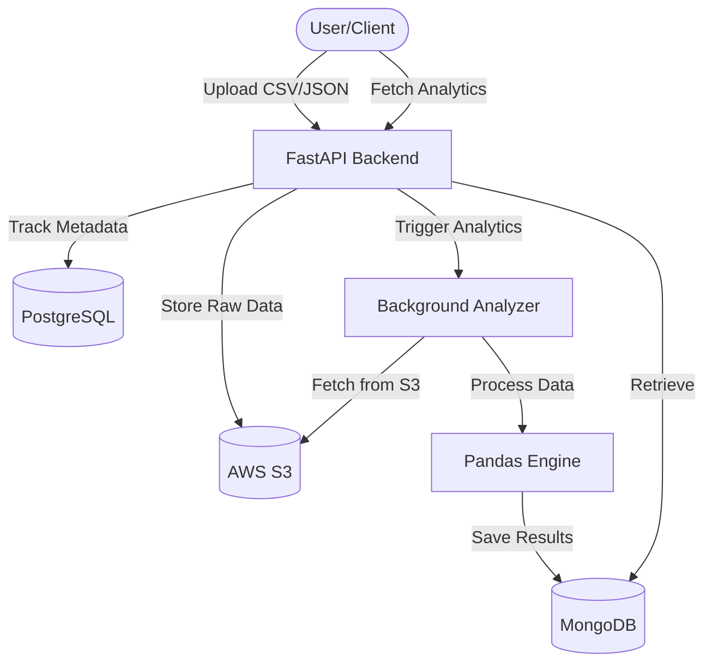

<p align="center">
  
  
  
  
  
  
</p>

# 🚀 InsightHub

**InsightHub** is a high-performance data ingestion and analytics backend. It provides a robust pipeline for uploading massive datasets (CSV/JSON), storing them securely on AWS S3, and leveraging a Pandas-powered engine to generate automated descriptive analytics stored in MongoDB.

---

## 🏗️ Architecture

InsightHub is designed with a decoupled, containerized architecture to ensure scalability and ease of deployment.



---

## ✨ Key Features

-   📂 **Dataset Ingestion**: Support for high-speed CSV and JSON uploads.
-   ☁️ **Cloud Storage**: Seamless integration with AWS S3 for reliable data persistence.
-   📊 **Automated Analytics**: Instant descriptive statistics (mean, median, null counts, etc.) generated via Pandas.
-   🗄️ **Dual-Database Strategy**: 
    -   **PostgreSQL** for relational metadata and dataset tracking.
    -   **MongoDB** for flexible, document-based storage of complex analytics results.
-   🐳 **Fully Containerized**: Orchestrated via Docker Compose for a "one-command" setup experience.

---

## 🛠️ Tech Stack

-   **Backend Framework**: [FastAPI](https://fastapi.tiangolo.com/) (Python 3.12+)
-   **Databases**: 
    -   [PostgreSQL](https://www.postgresql.org/) (Metadata)
    -   [MongoDB](https://www.mongodb.com/) (Analytics)
-   **Infrastructure**: 
    -   [AWS S3](https://aws.amazon.com/s3/) (Raw data storage)
    -   [Docker](https://www.docker.com/) & [Docker Compose](https://docs.docker.com/compose/)
-   **Data Processing**: [Pandas](https://pandas.pydata.org/)
-   **ODM/ORM**: [SQLAlchemy](https://www.sqlalchemy.org/) & [PyMongo](https://www.mongodb.com/docs/drivers/pymongo/)

---

## 🚀 Getting Started

### Prerequisites

-   Windows/Linux/macOS
-   [Docker Desktop](https://www.docker.com/products/docker-desktop/) installed
-   AWS Account with S3 permissions

### 1. Environment Configuration

Clone the repository and create a `.env` file based on the environment structure:

```bash
cp .env.example .env
```

Fill in your configuration:
- `AWS_ACCESS_KEY_ID` / `AWS_SECRET_ACCESS_KEY`
- `S3_BUCKET_NAME`
- `POSTGRES_USER` / `POSTGRES_PASSWORD`
- `MONGO_INITDB_ROOT_USERNAME` / `MONGO_INITDB_ROOT_PASSWORD`

### 2. Launch the Application

Use Docker Compose to spin up all services:

```bash
docker-compose up --build
```

The API will be available at `http://localhost:8000`. You can access the interactive documentation at `http://localhost:8000/docs`.

---

## 🔌 API Reference

| Endpoint | Method | Description |
| :--- | :--- | :--- |
| `/upload` | `POST` | Upload a new CSV/JSON dataset. |
| `/datasets` | `GET` | List all tracked datasets and their status. |
| `/analytics/{id}` | `GET` | Retrieve the generated analytics for a specific dataset. |
| `/health` | `GET` | Check system heartbeats. |

---

## 📂 Project Structure

```text
InsightHub/
├── app/
│   ├── core/          # Configuration & Settings
│   ├── db/            # Database Connections (PG & Mongo)
│   ├── models/        # SQLAlchemy Models
│   ├── routes/        # FastAPI Routers
│   ├── services/      # Business Logic (S3, Pandas Logic)
│   └── main.py        # Application Entry Point
├── data/              # Local data persistence (Docker)
├── docker-compose.yml # Service Orchestration
└── Dockerfile         # Backend Containerization
```

---

## 🗺️ Roadmap

- [ ] **JWT Authentication**: Secure endpoints with user roles.
- [ ] **Presigned URLs**: Direct-to-S3 client uploads to reduce server load.
- [ ] **Asynchronous Processing**: Migrate to Celery + Redis for intensive tasks.
- [ ] **Migrations**: Implement Alembic for PostgreSQL schema versioning.
- [ ] **Real-time Monitoring**: Integrate Prometheus & Grafana dashboard.
